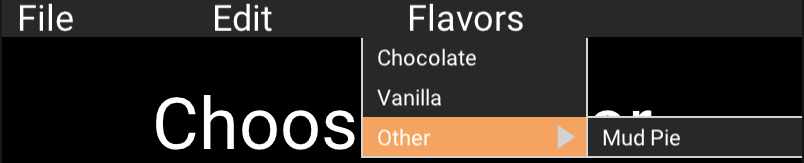

# Scenic widget contrib

This repo is intended as a "melting-pot" for experimental widgets, used by
Scenic applications - kind of like a communal workbench. If you are
developing a Scenic app, clone this repo and include it as a local dependency,
then as you develop new components, start putting them inside this library -
not only will developing your Scenic components this way mean they are
nicely de-coupled from your application logic, it makes them easier to
share & be improved upon by the broader community.

Licensed as [Apache 2.0](./LICENSE)

## Getting Started

Add `{:scenic_widget_contrib, github: "scenic-contrib/scenic-widget-contrib"}`
to your deps in mix.exs

## Widget Workbench

The **Widget Workbench** is an interactive development environment for building and testing Scenic components. It provides a live visual environment where you can load components, interact with them, and see changes in real-time.

### What is it?

The Widget Workbench is a Scenic application that acts as a testing ground for components. Think of it as a "component playground" where you can:

- Load and test individual Scenic components in isolation
- Interact with components to verify behavior
- See live updates as you modify component code (with auto-reload)
- Develop components visually without needing a full application

### What is it for?

- **Component Development**: Build new Scenic widgets in an isolated environment
- **Visual Testing**: See how your components look and behave in real-time
- **Interactive Debugging**: Click, hover, and interact with components to test event handling
- **Rapid Iteration**: Auto-reload watches for file changes and updates the UI automatically
- **Spex Testing**: Integrated with MCP (Model Context Protocol) for programmatic UI testing

### How to Start It

#### Option 1: Using the Mix Task (Recommended)

Start the workbench with the mix task, which automatically boots everything:

```bash
iex -S mix lib/mix/tasks/start_widget_wkb
```

This will:
1. Start an interactive IEx shell
2. Launch the Widget Workbench UI window
3. Start the MCP server on port 9999 (for programmatic control)
4. Enable auto-reload for live code updates

#### Option 2: Manual Start from IEx

If you prefer manual control, start IEx first and then call the function:

```bash
iex -S mix
```

Then in the IEx shell:

```elixir
iex> WidgetWorkbench.start()
```

#### Option 3: Start when developing a component outside of Scenic Widget Contrib

- Modify your mix.exs to refer to scenic contrib
- Start IEx
- Run code to start Widget Workbench and load your component using `WidgetWorkbench.Scene.load_component/3`:

``` elixir
def start_widget_workbench do
  WidgetWorkbench.start()
  opts = [pomodoro_timer: Pomodoro.PomodoroTimer.get_timer()]
  WidgetWorkbench.Scene.load_component("Pomodoro Timer", PomodoroUi.TimerComponent, opts)
end
```

### Using the Workbench

Once running, you can:

- **Click "Load Component"** to load a widget from the component library
- **Click "Reset Scene"** to clear the current widget
- **Interact with loaded components** to test their behavior
- **Modify component code** and save - the UI will auto-reload

### Available Commands (from IEx)

While the workbench is running, you can use these commands from the IEx shell:

```elixir
# Stop the workbench
WidgetWorkbench.stop()

# Reset to clean state (stop and restart)
WidgetWorkbench.reset()

# Hot reload the scene after code changes
WidgetWorkbench.hot_reload()

# Check if workbench is running
WidgetWorkbench.running?()
```

### MCP Integration

The Widget Workbench includes an MCP server on port 9999, enabling programmatic control for automated testing. This is used by the Spex testing framework to interact with components programmatically.

## Components

### MenuBar

- [MenuBar](./lib/components/menu_bar/)
- Status: Polished

A nested menu at the top of the screen:



### FrameBox

- [FrameBox](./lib/components/frame_box/)
- Status: For Debugging

### TestPattern

- [TestPattern](./lib/components/test_pattern/)
- Status: In Development

## Getting Involved

See [CONTRIBUTING.md](./CONTRIBUTING.md) for info on contributing your own
widgets and see [DEVELOPMENT.md](./DEVELOPMENT.md) for info on developing your
own widgets.
