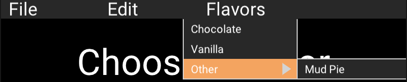

# Scenic widget contrib

This repo is intended as a "melting-pot" for experimental widgets, used by
Scenic applications - kind of like a communal workbench. If you are
developing a Scenic app, clone this repo and include it as a local dependency,
then as you develop new components, start putting them inside this library -
not only will developing your Scenic components this way mean they are
nicely de-coupled from your application logic, it makes them easier to
share & be improved upon by the broader community.

Licensed as [Apache 2.0](./LICENSE)

## Getting Started

Add `{:scenic_widget_contrib, github: "scenic-contrib/scenic-widget-contrib"}`
to your deps in mix.exs

## Components

### MenuBar

- [MenuBar](./lib/components/menu_bar/)
- Status: Polished

A nested menu at the top of the screen:



### FrameBox

- [FrameBox](./lib/components/frame_box/)
- Status: For Debugging

### TestPattern

- [TestPattern](./lib/components/test_pattern/)
- Status: In Development

## Building blocks

Not components themselves, but what components are built from.

### Widgex.Frame

- [Widgex.Frame](./lib/widgex/structs/frame.ex)

A rectangle: its top-left `pin` and its `size`. Components take one to know
where they sit and how much room they have. Frames split into rows and
columns, which is how a whole window gets laid out:

```elixir
frame = Widgex.Frame.new(viewport)
[menu_bar, rest] = Widgex.Frame.v_split(frame, px: 40)
[sidebar, editor] = Widgex.Frame.h_split(rest, px: 240)
```

### Widgex.Scrollable

- [Widgex.Scrollable](./lib/widgex/scroll/scrollable.ex)

Scrolling for any component whose content outgrows its frame: scroll state,
wheel handling, a clipped content group and scrollbars, with the arithmetic
in pure functions (`Widgex.Scroll.ScrollReducer`,
`Widgex.Scroll.ScrollController`) that test without a viewport.

## Getting Involved

See [CONTRIBUTING.md](./CONTRIBUTING.md) for info on contributing your own
widgets and see [DEVELOPMENT.md](./DEVELOPMENT.md) for info on developing your
own widgets.
